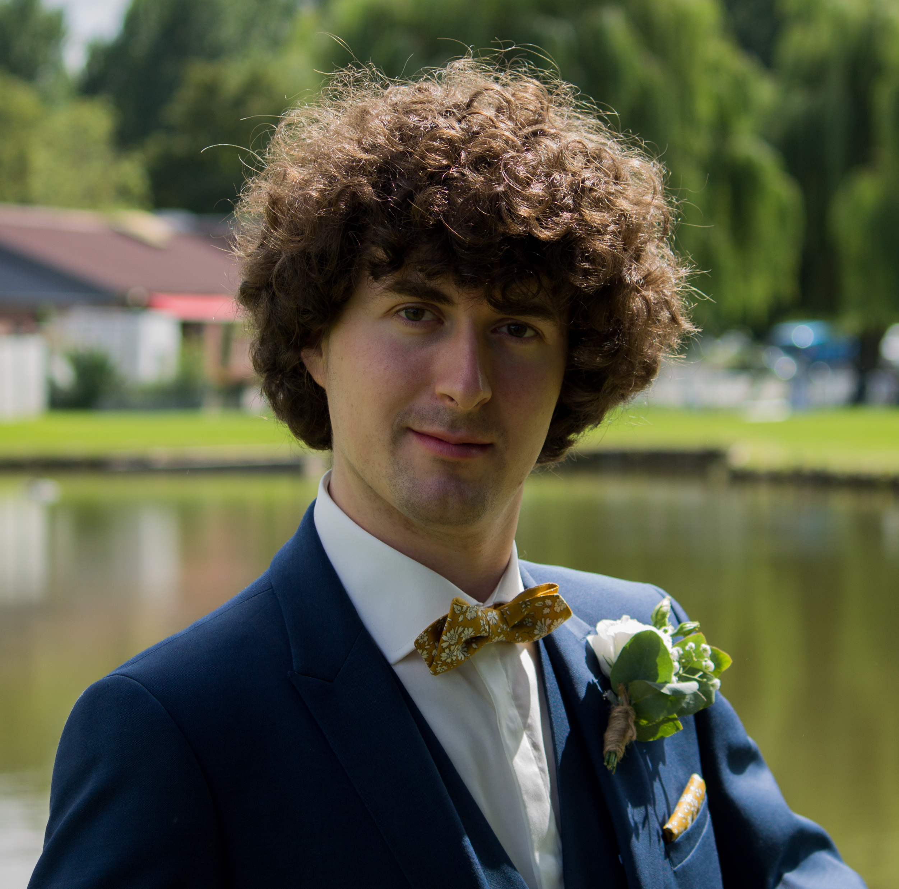

---
title: Page of Corentin Barloy
...

* Email: corentin DOT barloy AT inria DOT fr
* Current position: PhD @ CRIStAL/INRIA in [LINKS team](https://team.inria.fr/links/fr/)
* advisors
    - [Charles Paperman](https://paperman.name)
    - [Michaël Cadilhac](https://michael.cadilhac.name/)
    - [Sylvain Salvati](https://www.labri.fr/perso/salvati/)
* French [CV](pdfs/cv.pdf)

# PhD subject

My main area of interest are automata theory, circuit complexity and algebraic semigroups.
I especially try to find lower bounds for small-depth circuit with linear numbers of wires or gates.

# Publications list
[dblp](https://dblp.org/pid/247/1049.html)

## In proceedings of conferences

* [A robust class of linear recurrence sequences](https://drops.dagstuhl.de/opus/volltexte/2020/11652/)
 C. Barloy, N. Fijalkow, N. Lhote et F. Mazowiecki, CSL, 2020.

* [Bidimensional linear recursive sequences and universality of unambiguous register automata](https://drops.dagstuhl.de/opus/volltexte/2021/13653/)
 C. Barloy et L. Clemente, STACS, 2021.

* [Stackless processing of streamed trees](https://hal.archives-ouvertes.fr/hal-03021960)
 C. Barloy, F. Murlak et C. Paperman, PODS, 2021.

* [The regular languages of first-order logic with one alternation](https://dl.acm.org/doi/10.1145/3531130.3533371) 
 C. Barloy, M. Cadilhac, C. Paperman, T. Zeume, LICS, 2022.

## In journals

* [A robust class of linear recurrence sequences](https://www.sciencedirect.com/science/article/pii/S0890540122001195?via%3Dihub)
 C. Barloy, N. Fijalkow, N. Lhote et F. Mazowiecki, Information and Computation, 2022.

#  Slides of my talks

* A robust class of linear recurrence sequences
    - [Highlights 2019](pdfs/robust_highlights.pdf)
    - [CSL 2020](pdfs/robust_csl.pdf)
* Bidimensional linear recursive sequences and universality of unambiguous register automata
    - [Highlights 2020](pdfs/universality_highlights.pdf) (poster)
    - [STACS 2021](pdfs/universality_stacs.pdf)
    - [STACS 2021](https://www.youtube.com/watch?v=iDvoxUGR6kQ&list=PLtP1eXEDZj65DwBQ0IbZN4mTydkQ1Cbo3&index=3) (recording)
* Stackless processing of streamed trees
    - [PODS 2021](pdfs/stackless_pods.pdf)
    - [PODS 2021](https://www.youtube.com/watch?v=3OmtIJU7BNw) (recording)
* The regular languages of first-order logic with one alternation
    - [LICS 2022](pdfs/sigma2_lics.pdf) 
    - [Extended](pdfs/sigma2_full.pdf)

# Teaching

* 2021-2022
    - [TD/TP Algorithmes et Programmation 1](https://www.fil.univ-lille.fr/portail/index.php?dipl=L1&sem=S2&ue=AP&label=Pr%C3%A9sentation) (Univ. Lille)
    - [TD/TP Base de Données 1](https://www.fil.univ-lille.fr/portail/index.php?dipl=L&sem=S3&ue=BDD1&label=Pr%C3%A9sentation) (Univ. Lille)
  
* 2022-2023
    - [TD/TP Algorithmes et Programmation 1](https://www.fil.univ-lille.fr/portail/index.php?dipl=L1&sem=S2&ue=AP&label=Pr%C3%A9sentation) (Univ. Lille)
    - Colles d'informatique en MPI (Faidherbe)

* 2023-2024
    - [TP UNIX](https://www.fil.univ-lille.fr/portail/index.php?dipl=L&sem=S3&ue=Unix&label=Pr%C3%A9sentation) (Univ. Lille)
    - [Cours/TD/TP Bases de Données Relationnelles](https://www.fil.univ-lille.fr/portail/index.php?dipl=MInfo&sem=ML&ue=BDR&label=Pr%C3%A9sentation) (Univ. Lille)
        - [Séance 1](cours/BDR/cours1.zip)
        - [Séance 2](cours/BDR/cours2.zip)
        - [Annales](cours/BDR/annales.zip)
    - Colles d'informatique en MPI (Faidherbe)

